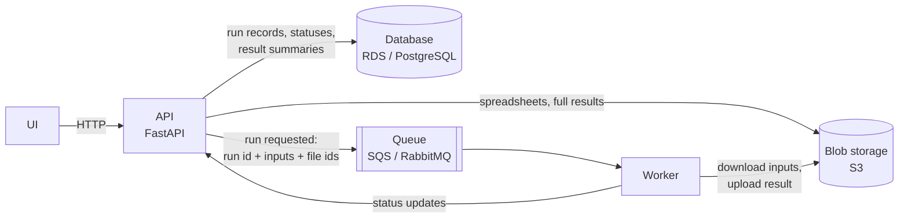
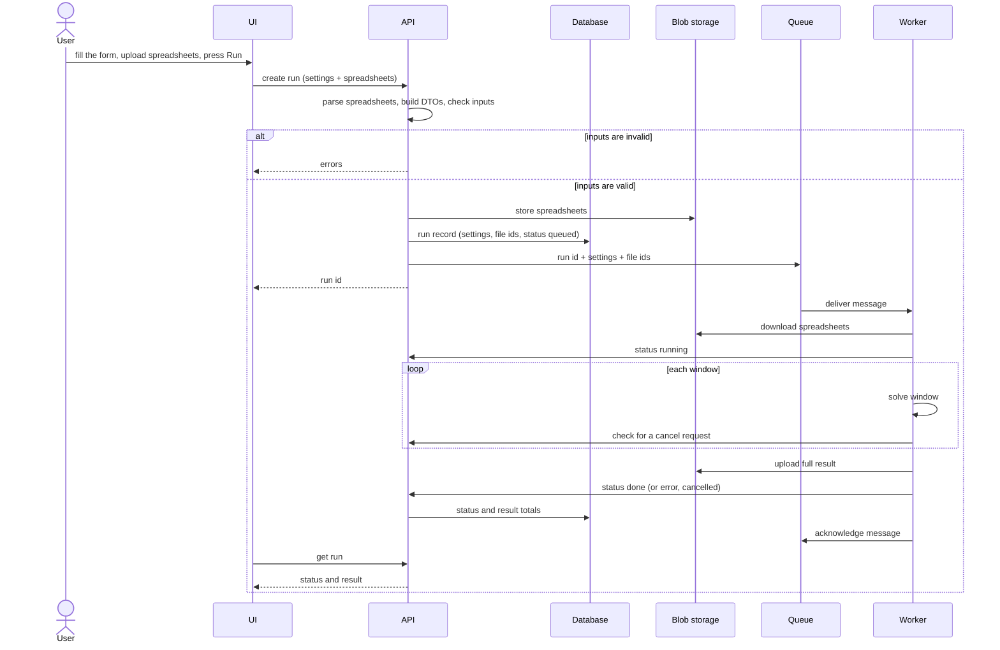

# Production architecture and next steps

## Where the project stands

This repository was built for a recruitment exercise. The model (DTOs, loaders, MILP solver, rolling windows) was designed and reviewed with care; the Streamlit UI was mostly AI-generated and made to run locally with one command. The UI's run machinery (session folders on local disk, a process per run, statuses in plain files) is a prototype: it is not production grade. Stopping the app stops its runs, there is no authentication, and everything shares one machine.

This document describes how I would run it in production, and why the code is already shaped to get there with little change.

## Target architecture

### A run, step by step

### API

- The only entry point: the UI, scripts or other services talk to it, never to the database, storage or workers.
- **Receives** a run request: the spreadsheets and the run settings (battery state, horizon, window size, market steps, solver options).
- **Validates** before accepting anything: parses the spreadsheets, builds the DTOs and runs the solver's input checks. Invalid requests are rejected with the errors, and nothing is stored.
- **Stores** the spreadsheets in blob storage and a run record (settings, file ids, status `queued`) in the database.
- **Publishes** a message to the queue with the run id, the run settings and the ids of the stored files.
- **Serves** run lists, statuses and results, and accepts cancel and rerun requests.
- **Receives status updates** from workers (`running`, `done`, `error` with its description, `cancelled`).

### Worker

- Consumes one message at a time, downloads the files by id, parses them, solves window by window, uploads the full result to blob storage and reports the outcome to the API.
- Runs completely isolated from the API and from other runs, so it can be scaled on its own: more workers when the queue is long, and bigger machines (more CPU and memory for HiGHS, or a commercial solver licence) without touching the API.
- Acknowledges the message only after reporting the outcome, so a worker that dies mid-run leaves the message to be retried instead of a run stuck in `running`.

### UI

- Talks only to the API. It no longer imports the solver or the loaders, and holds no state of its own beyond the page.

## Why the code is ready for this

The prototype already separates the steps the production system needs; each maps to a component:

| Step | Today | In production |
| --- | --- | --- |
| Validate a request | `aurora_er.sessions.validation_errors(config)`: parses the spreadsheets, builds DTOs, runs `validate_inputs`, returns errors without solving | Called by the API before storing anything |
| Describe a run | `RunConfig` with typed DTOs; serialised by `config_to_yaml` / `config_from_yaml` | The message payload and the run record |
| Run | `aurora_er.sessions.run_session(store, session_id, backend)`: reads the run, solves, writes the result and status; never raises | The worker's message handler |
| Solve | `aurora_er.app.run(config, backend, on_window_solved)` over `solve_rolling`; the backend is injected (`HighsBackend`) | Unchanged; a different backend (e.g. Gurobi) is a configuration choice |
| Report progress, cancel | `on_window_solved` callback between windows; cooperative cancel | The worker checks for a cancel request and reports status through the same callback |
| Store results | `RollingDispatchResultDTO` serialised by `result_to_json` / `result_from_json` | Full result in blob storage, totals in the database for listing |
| Read inputs | `aurora_er.loading`: file reading separated from pure conversions (`*_from_frame`) | Unchanged; the worker reads downloaded files, the API can validate from uploaded bytes |

Because `run_session` receives its storage and its solver as arguments, the worker is the same function with production implementations passed in.

## What has to change

1. **Extract interfaces from `SessionStore`.** Today it is one concrete class tied to local folders (`Path`s, moving files). Split it into a run repository (config, status, result, cancel flag) and a file store (put/get spreadsheets by id), as `Protocol`s, with the current folder-based classes as the local implementation and database/blob-storage classes for production.
2. **Add the API** (FastAPI): endpoints to create, list, get, cancel and rerun runs; it owns validation, storage and publishing.
3. **Add the worker entry point:** a loop that consumes messages and calls `run_session` with the production repository, file store and backend; status updates go to the API.
4. **Point the UI at the API** through a small client, replacing its direct imports of `aurora_er.sessions`, `aurora_er.loading` and `aurora_er.solver`.
5. **Retire the prototype run machinery:** local session folders, spawned processes and the "interrupted on start-up" check, which the queue's retries replace.

## Production concerns

- **Idempotency:** a message may be delivered more than once; the worker skips runs already `done` and writes results under the run id.
- **Retries and dead letters:** failed messages are retried a bounded number of times, then moved to a dead-letter queue with the run marked `error`.
- **Cancellation:** the API records the request; the worker sees it between windows. A hard stop (killing the worker's task) can be added for long windows.
- **Security:** authentication on the API, size and type limits on uploads, private buckets, credentials from a secrets manager.
- **Observability:** structured logs with the run id, metrics on queue depth, run duration and failures, alerts on dead letters.
- **Data:** large time-series results stored in a columnar format (e.g. Parquet) instead of JSON; retention rules for old runs.
- **Reproducibility:** each run stores the exact inputs, settings and package version used.

## Modelling next steps

Independent of the architecture, the model has known limitations (see the [problem definition](problem-definition.md)):

- **Look-ahead between windows:** solve each window plus a few extra days and keep only the window's decisions, so windows stop ending with an empty battery.
- **Value of stored energy at a window end:** an alternative to look-ahead for the same problem.
- **Battery value by calendar age** as well as cycles, and by volume already lost to degradation.
- **Separate buy and sell prices** are supported by the model; data with a bid/ask spread would exercise them.
